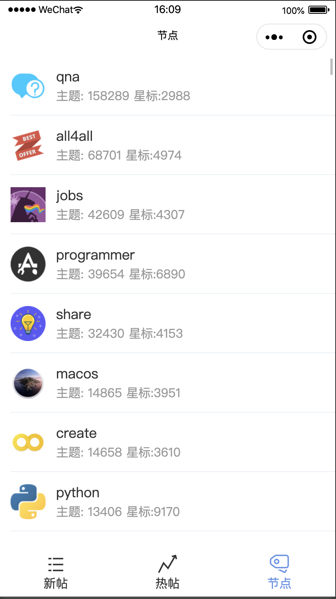
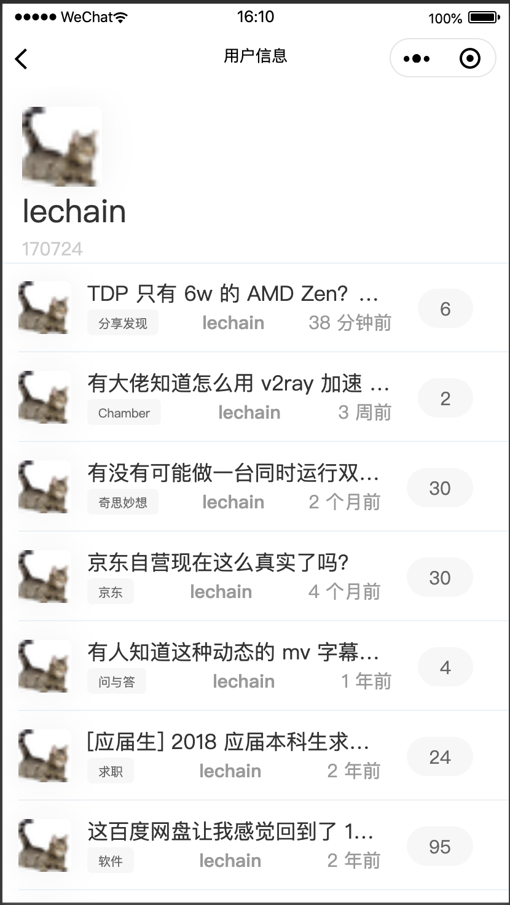

# Taro + Taro-UI + Vue + V2EX API 多端小程序

如题，这是一个使用了这几个技术的练习项目。我是第一次使用Taro和写微信小程序。Taro官方有个[渐进式教程](https://taro-docs.jd.com/taro/docs/guide/)，使用的也是V2EX的API。
## 技术栈：
- [Taro](https://github.com/NervJS/taro)
- [Taro-UI](https://github.com/NervJS/taro-ui)
- [Taro-ui-vue](http://taro-ui-vue.fontend.com/)
- [V2EX API](https://github.com/igaozp/V2EX-API)
- Vue
- Vuex
- SCSS
- Typescript

## 本地运行和测试
- `yarn`
- `yarn dev:weapp`
- 因为调用了v2ex 的API，用自己的微信小程序ID的话，需要去后台设置一下域名白名单，否则 API 调用会失败。

## 比教程多了一些的是：
- 代码完整。官方教程的代码比较零散，甚至有些跑不通。
- 用户详情页面和节点详情页面
- 全部使用真正的V2EX API 而不是使用自定义数据
- 自定义 Tabbar
- 使用了Taro-UI来做界面

## 项目存在的问题：
以下是我知道的主要问题。大佬们如果发现新问题或者知道这些问题的答案，欢迎提 issues 或者 PR， 望不吝赐教。

- 几个页面在切换的时候并不会刷新。这里怀疑是Taro的bug，文档中写的 [onShow](https://nervjs.github.io/taro/docs/vue/#onshow-1) 方法并不能在页面显示的时候被成功调用。
- 不怎么好看。因为主要用来熟悉Taro以及微信小程序和多端小程序开发，因此并未在界面上花功夫，几乎没有怎么写样式。使用的全都是Taro-UI 默认的组件。
- 有点卡。一方面v2ex并未提供分页的API。有些 endpoints 诸如获得节点列表、帖子列表等，都是一大堆上千条数据一下子全返回。网络慢的时候导致卡顿更加明显。
- TypeScript 使用并不规范。我很少写 TypeScript。也一直懒得学，因此基本上都是用JavaScript 的写法在写 TypeScript。同样，写好或者学习 TypeScript 也并不是我写本项目的目的。略过。
- CustomTabBar 的实现并不规范。现在的做法是写一个 CustomTabBar, 然后放置进每个页面中。正确的做法应该是:
    1. 在 `app.config.ts` 中的`tabList` 里，设置 `custom: true`
    2. 在 `src` 目录下新建 `custome-tab-bar` 文件夹
    3. 在 `custome-tab-bar` 下面添加 `index.js`,`index.wxml`, `index.wxss` 来自定义 tabbar 的样式和行为。 需要注意的是，这里不能直接写 `index.vue`，编译不出来的。

